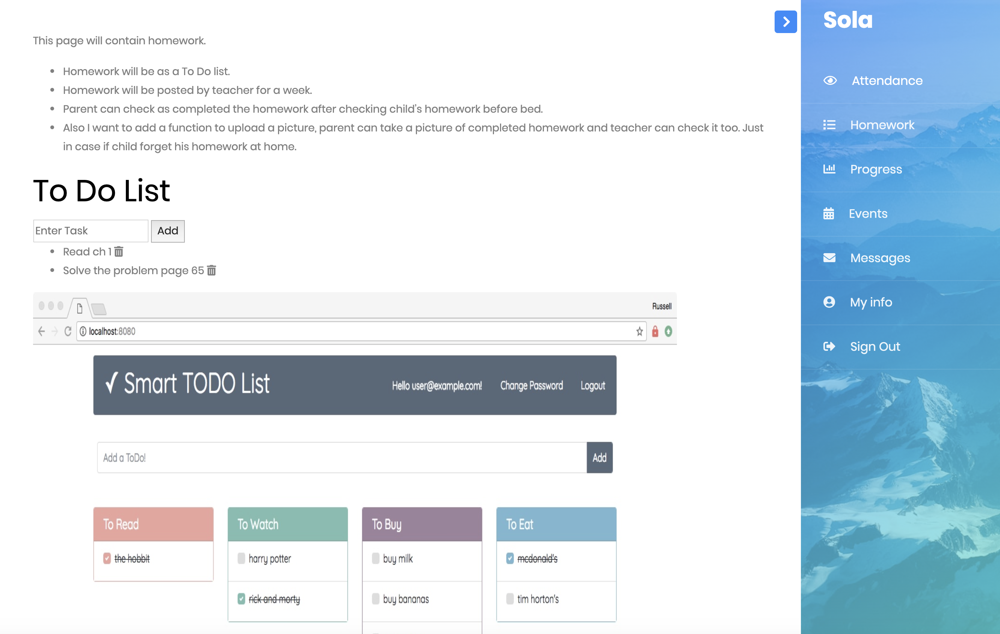

# Sola

## About:

Sola is an application that will help parents to keep track of their child's progress at school. This application will allow them to check their child's attendance, homework and grades at school. Parents can also see school news and events. And they can send messages to teachers and other parents.

## Installation

1. Clone repo
2. run `npm install`

## Usage

1. run `node server.js`
2. Navigate to `localhost:4444`
